<div align="center">


<h1>AIOps Incident Predictor</h1>

<p><strong>The Enterprise Flagship Platform for Predictive Reliability, Anomaly Detection, and Automated Remediation</strong></p>

[](https://devopstrio.co.uk/)
[](/terraform)
[](/terraform)
[](https://devopstrio.co.uk/)

<br/>

> **"Fixing incidents is Ops. Preventing incidents is AIOps."** The AIOps Incident Predictor is a production-hardened machine learning platform engineered to transform reactive operations into proactive reliability.

</div>

---

## 🏛️ Executive Summary

The **AIOps Incident Predictor** provides a definitive "Nerve Center" for Site Reliability Engineering (SRE) and Network Operations Center (NOC) teams. By digesting fragmented telemetry across the enterprise and processing it through predictive correlation engines, the platform identifies cascading failures before business impact occurs.

### Strategic Business Outcomes
- **Zero-Day Predictive Resolution**: Identifies latency spikes and capacity exhaustion 45-90 minutes before SLA breach.
- **Alert Noise Reduction**: Correlates thousands of redundant alerts into single, actionable Root Cause incidents.
- **Automated Remediation**: Triggers predefined "Auto-Healing" workflows for known failure signatures.
- **Business Impact Intelligence**: Prioritizes incidents dynamically based on CMDB topology and financial risk.

---

## 🏗️ Technical Architecture

### 1. High-Level Architecture
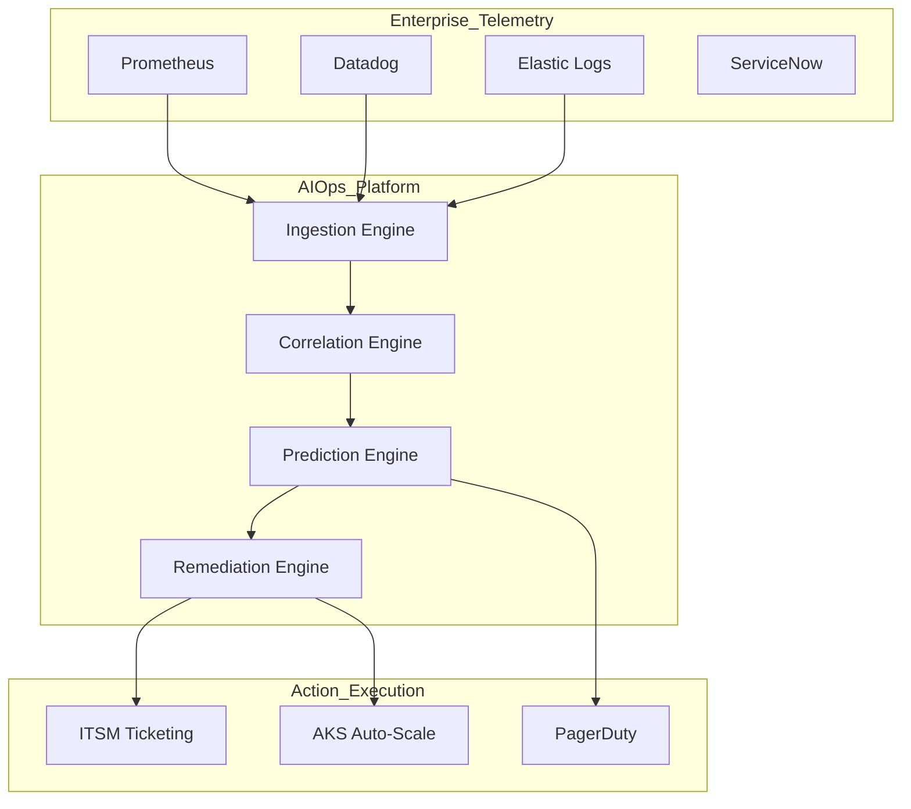

### 2. Telemetry Ingestion Flow
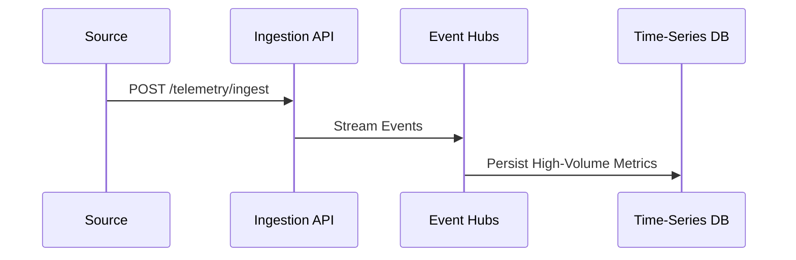

### 3. Prediction Engine Workflow
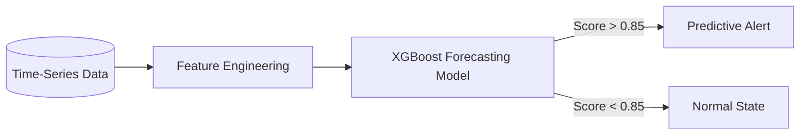

### 4. Incident Correlation Flow
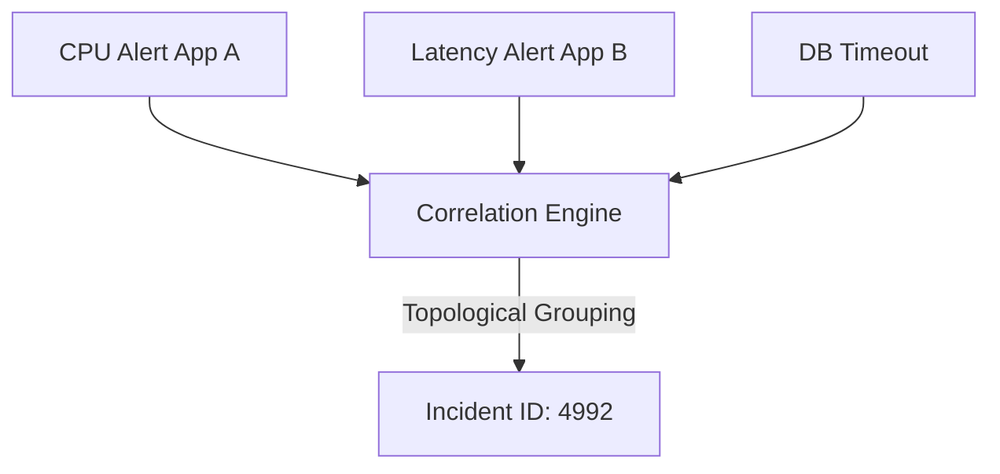

### 5. Auto-Remediation Workflow
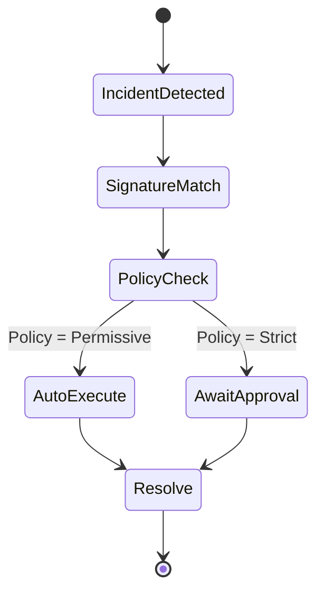

### 6. Security Trust Boundary
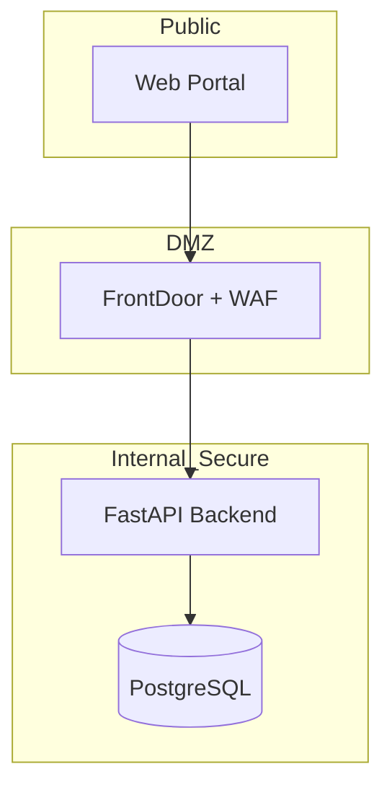

### 7. AKS Topology
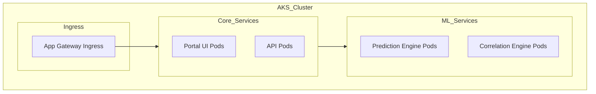

### 8. API Lifecycle
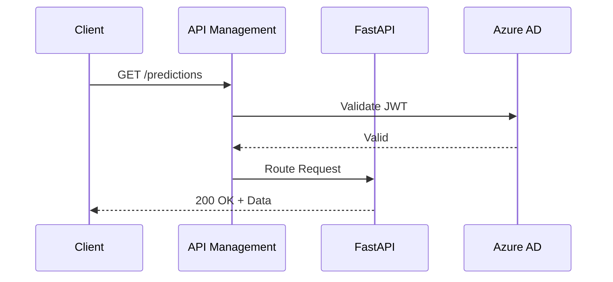

### 9. CI/CD Pipeline
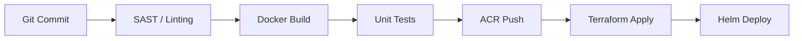

### 10. Multi-Tenant Model
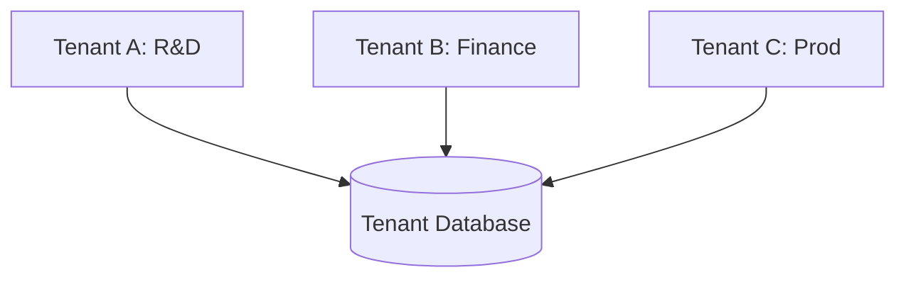

### 11. Disaster Recovery Topology
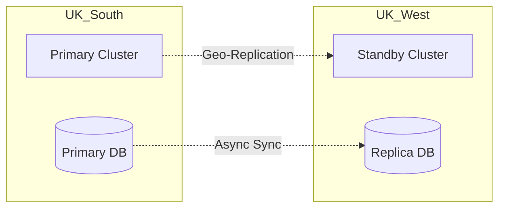

### 12. ML Training Pipeline
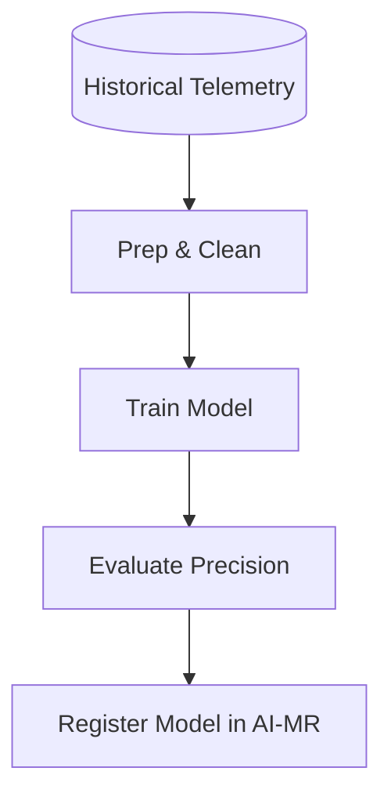

### 13. Alert Reduction Flow
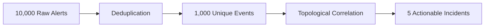

### 14. ITSM Integration Flow
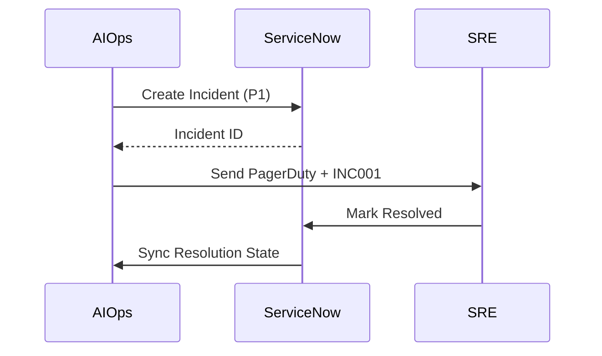

### 15. Executive Reporting Flow
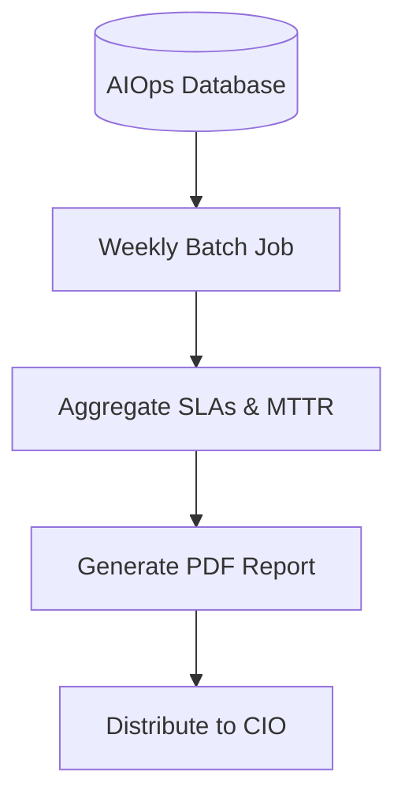

---

## 📦 Global Infrastructure Stack

| Layer | Component | Technology | Priority |
|:---|:---|:---|:---:|
| **Portal** | SRE Command Center | Next.js 14 / Tailwind | Presentation |
| **API** | Telemetry Gateway | FastAPI / Python | Integration |
| **Intelligence** | Prediction & Correlation | PyTorch / scikit-learn | Core Logic |
| **Persistence** | Metrics & Topology | PostgreSQL + Redis | State |
| **Platform** | Auto-Scaling Compute | AKS / Azure Container Apps | Infrastructure |

---

## 🚀 Deployment Guide

### Terraform Orchestration
```powershell
# Deploy the Primary Hub and Core AI Services
cd terraform/environments/prod
terraform init
terraform apply -auto-approve
```

### 🗺️ Platform Roadmap

- **Phase 1**: Ingestion & Baseline Correlation (Rule-based).
- **Phase 2**: Machine Learning Failure Prediction for CPU/Memory/Disk.
- **Phase 3**: Fully Autonomous Multi-Cluster Operations (Zero-Touch Remediation).

---
<sub>&copy; 2026 Devopstrio &mdash; The Future of Enterprise Reliability.</sub>
